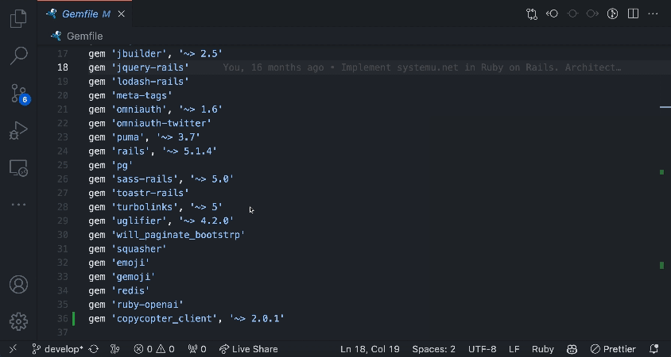

# VS Code Ruby Gemfile Extension

`ruby-gemfile` is an extension which provides the hover LINK in the Gemfile which allow to open gem info on the [RubyGems](https://rubygems.org/gems/) site.

## Features

* Provide hover link in Gemfile refers to online RubyGems site.

## Usage

Hover over particular Ruby Gem in the Gemfile to show an information dialog.

-----------------------------------------------------------------------------------------------------------

Enjoy!